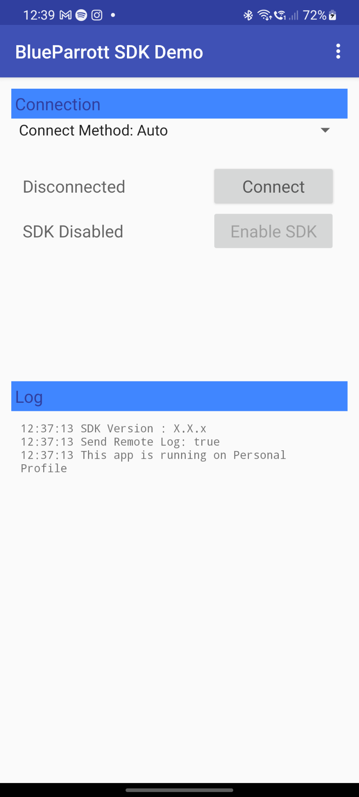
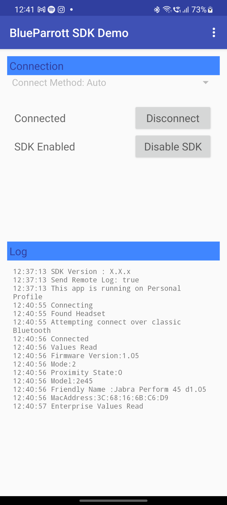
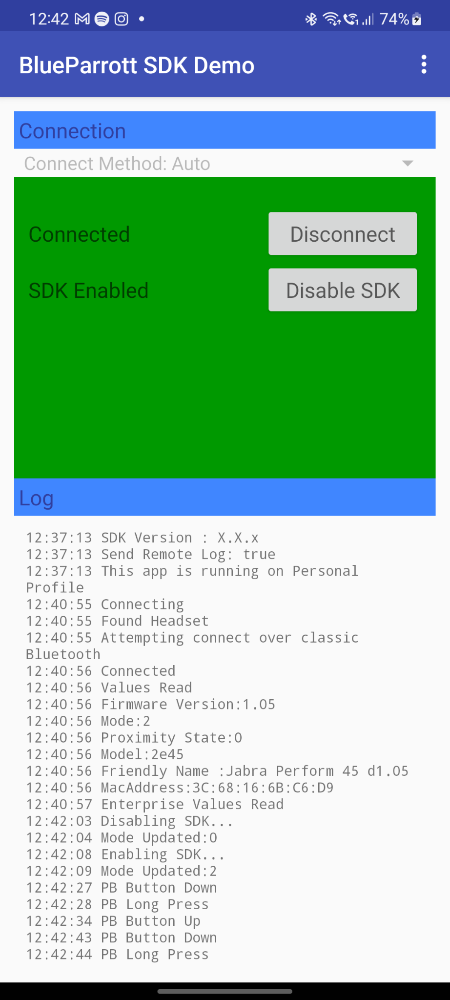

# Jabra Perform / BlueParrott SDK for Android

# Introduction

This document is an introduction to the Jabra Perform BlueParrott (JPBP) SDK for
Android that allows access to the Configurable Button on selected Jabra and
BlueParrott headsets. 

The Configurable Button on the headset has an initial factory setting that
allows the user to mute the headset microphone. This Configurable Button can be
accessed from a mobile application to program alternative functions.

The JPBP SDK enables developers to create apps that interact with this
Configurable Button thus allowing the headset user to access functions of your
application by pressing the Configurable Button.

# SDK Purpose

The purpose of the JPBP SDK is to let you, a corporate or independent developer,
develop applications that allow the end user to benefit from alternative
functions for the Configurable Button found on a range of Jabra and BlueParrott
headsets (see [Appendix A](#appendix-a-supported-headsets)).

Through use of the JPBP SDK you can access the Configurable Button. When your
mobile application has been published the headset user may then control
programmed activities within your mobile application directly from the headset
via the Configurable Button.

Typical uses of the JPBP SDK include integration with:
- Push to Talk and Voice Messaging Applications, where recording is triggered by
pressing the Configurable Button
- Voice Recognition and custom Voice Assistant applications, where the Voice
Assistant is triggered by tapping the Configurable Button
- Other Enterprise Applications, where custom features can be triggered based on
one or more button event 

The Configurable Button can be configured to trigger up to five Button Events in
your application:
- Press (for example to start a Push to Talk Call)
- Release (for example to end a Push to Talk Call)
- Single Tap (to invoke a voice recognition or other enterprise application)
- Double Tap
- Long Press

You may program each of these events for individual functions within your mobile
application.

The SDK can also report changes in the proximity sensor on the headset (where
available, not all headsets contain a proximity sensor).

The Configurable Button may also be programmed to a number of functions that do
not result in events being sent to the application (e.g., Speed Dial).

You may limit your application to operating in the foreground only or you may
wish to offer a smoother, more integrated experience for the headset user by
extending your application to offer handling of button events even when your
application is in the background.

# SDK Scope

The JPBP SDK provides interfaces to the following functions in compatible headsets (see
[Appendix A](#appendix-a-supported-headsets)):
- Setting the Configurable Button into 'SDK Mode', this will result in button
events being sent to your application
- Event Handlers for Configurable Button events
- Configuring the Configurable Button to Speed Dial: Dials the specified phone
number when the button is pressed
- Configuring the Configurable Button to Mute: Disables the microphone on the
headset during a phone call. Pressing the Configurable Button again will un-mute
the headset
- Setting the Configurable Button to “App Mode” with a specific App ID and App
Name This allows another app using the SDK to receive button events, and if
multiple apps are installed that make use of the Configurable Button, each can
check if they are the currently configured app
- Setting the Configurable Button to a custom mode. Some headsets may offer
features that can be accessed through the Configurable Button by configuring it
to a custom mode. For more details on custom modes, contact your
Jabra/BlueParrott representative
- Listening for Proximity change events (on supported headsets), when the user
puts the headset on and off their head 

The package includes the following development tools:
- SDK Library
- Example test application to show connectivity and connected device Configurable Button
state
- Notes and reference documentation

## Not in Scope

This document does not cover Android programming specifics, the developer should
access the relevant sites for the development language.

# Updates

The JPBP SDK will be updated from time to time, please check for updates at the following
location: [https://github.com/gna-sw](https://github.com/gna-sw)

# Supported Operating Systems

The current JPBP SDK for Android supports Android 6 and higher.

# Getting Started

## Including the SDK

The JPBP SDK is hosted in the [Maven Central
Repository](https://central.sonatype.com/artifact/com.blueparrott/blueparrottsdk).
Add the latest version to your project by declaring it as a dependency in
your `build.gradle` file:

```groovy
dependencies {
    implementation 'com.blueparrott:blueparrottsdk:+`
}
```

You can also specify a specific version by replacing the `+` with a version
number:

```groovy
dependencies {
    implementation 'com.blueparrott:blueparrottsdk:4.8.1`
}
```

If needed, you can also use the JPBP SDK binary directly. To do so, import
`blueparrottsdk-release.aar` into your project as a module. Then, add the
dependency in your `build.gradle` file:

```groovy
dependencies {
    compile(name: 'blueparrottsdk-release', ext: 'aar')
}

repositories {
    flatDir {
        dirs 'libs'
    }
}
```

## How the SDK Connects to the Headset

SDK Communication between the handset and headset is via Bluetooth and can be
over one of three connection modes
- Auto
- Bluetooth Classic (BR/EDR)
- Bluetooth Low Energy (BLE). 

(This SDK connection is separate to the normal connection between the handset
and headset for audio/call handling which is handled automatically by the
operating system) All headsets support SDK connection via BLE, and most but not
all support the SDK connection over Bluetooth Classic.

This can be transparent to the developer, although in certain circumstances you
may wish to force the SDK to connect over a Bluetooth Classic connection. On
some Android versions this is more stable, and also requires fewer permissions,
making it easier to integrate into Enterprise Applications.

You may choose to force the SDK to connect via Bluetooth Classic, BLE, or allow
it to automatically select the protocol using the Auto option, which will
attempt to connect via Bluetooth Classic first, and if that fails will attempt
to connect over BLE.

## Permissions

### Enable Bluetooth

The JPBP SDK manages the Bluetooth connection but you must manage the enabling
of Bluetooth in your code. An approach to this is to alert the application user
if Bluetooth is not available and ask the user to turn Bluetooth on in their
handset settings, you must then provide another opportunity to connect.

### Manifest Permissions

For Bluetooth Classic Connections you need the following permissions:

```xml
<!-- Request legacy Bluetooth permissions on older devices. -->
<uses-permission android:name="android.permission.BLUETOOTH"
                 android:maxSdkVersion="30" />

<uses-permission android:name="android.permission.BLUETOOTH_ADMIN"
                 android:maxSdkVersion="30" />

<!-- Needed to connect on Android 12+ for any Bluetooth connection -->
<uses-permission android:name="android.permission.BLUETOOTH_CONNECT" />
```

For BLE Connections, you need the following permissions in your manifest:

```xml
<!-- Legacy permissions to scan over BLE prior to Android 12 -->
<uses-permission android:name="android.permission.ACCESS_COARSE_LOCATION" />
<uses-permission android:name="android.permission.ACCESS_FINE_LOCATION" />

<!-- 
Needed only if your app looks for and connects over 
Bluetooth Low Energy on Android 12+ 
-->
<uses-permission android:name="android.permission.BLUETOOTH_SCAN"
                 android:usesPermissionFlags="neverForLocation" />
```

### Runtime Permission Prompts

For many permissions, you will need to prompt the user to grant access in your
application at runtime. The following permissions require runtime permissions.
For an example of how to code these permission requests, see the source code for
the Demonstration App.

```xml
"android.permission.BLUETOOTH_CONNECT"
"android.permission.ACCESS_COARSE_LOCATION"
"android.permission.ACCESS_FINE_LOCATION"
"android.permission.BLUETOOTH_SCAN"
```

## Connect to the Configurable Button

The JPBP SDK connect() method creates a connection from your application to the
headset. As described above, there are a number of methods to connect depending
on the headset being used. Auto attempts to connect via Bluetooth Classic first
and if that fails will attempt to connect over BLE. The connect() method takes
one of the following parameters.

|            |             |
| ---------- | ----------- |
| `CONNECT_METHOD_AUTO`  | Attempts to connect to SDK via Bluetooth Classic connection. If this fails will attempt connection over BLE |
| `CONNECT_METHOD_CLASSIC` | Attempts to connect to SDK via Bluetooth Classic connection |
| `CONNECT_METHOD_BLE` | Attempts to connect to SDK via BLE connection |

```java
import com.blueparrott.blueparrottsdk.BPSdk;
import com.blueparrott.blueparrottsdk.BPHeadset;

BPHeadset headset;

// Get a handle to the Configurable Button on the headset
headset = BPSdk.getBPHeadset(this);

if (!headset.connected()) {
    Log.d(TAG, "Connecting");
    headset.connect(CONNECT_METHOD_AUTO);
    // Perform your own code
}
```

## Listen for Connection Events

Through the JPBP SDK your app can get a handle to the Configurable Button on the
headset, you can then add a Headset Listener. 

The Headset Listener allows your application to listen for the stages associated
with establishing a connection to the Configurable Button through the methods
- onConnect - when the SDK has successfully connected over bluetooth
- onConnectFailure - when the SDK has failed to connect
- onConnectProgress - an event to monitor the steps in making the connection
- onValuesRead - after the sdk has connected it reads some headset values
  (firmware version etc.) and these are now available to read

### Connected

When your app is successfully connected to the Configurable Button a connected
event is triggered.

```java
...
    // override method in IBPHeadsetListener
    @Override
    public void onConnect() {
        Log.d("Connected");
        // place your code here
    }

    @Override 
    public void onValuesRead() {
        Log.d(TAG, "headset values are available to use");
        // can now read appname, firmware version, etc.
    }
```

### Connection Failure

If the connection attempt fails the onConnectFailure method is called with an
error Code which can be handled in your code.

```java
// Method from class: com.blueparrott.blueparrottsdk.BPHeadsetListener
@Override
public void onConnectFailure(int errorCode) {
    // handle the connection failure here
    // this may include instruction "Retry or turn the headset off then on"
}
```

| **Reason Code** | **Value** | **Meaning** |
| --------------- | --------- | ----------- |
| `UPDATE_ANDROID`  | 1 | Android OS 4.4 or greater required for Classic Connection |
| `BLUETOOTH_NOT_AVAILABLE` | 2 | Bluetooth is not turned on |
| `ALREADY_CONNECTED` | 3 | Parrott Button is already connected |
| `ALREADY_CONNECTING` | 4 | Another connection attempt is already under way |
| `NO_HEADSET_CONNECTED` | 5 | There is no Bluetooth headset connected |
| `HEADSET_NOT_SUPPORTED` | 6 | Headset may not support Configurable Button |
| `UPDATE_YOUR_FIRMWARE` | 7 | Firmware on the headset is not offering Configurable Button Service. Firmware may be too old |
| `UPDATE_YOUR_SDK_APP` | 8 | This SDK/App is too old to connect to the firmware version on headset | 
| `HEADSET_DISCONNECTED` | 9 | Headset Bluetooth Classic connection disconnected during BLE connection attempt |
| `TIMEOUT` | 10 | Unknown error, connection attempt has timed out |
| `BLE_REQUIRES_LOLLIPOP` | 11 | Android OS 5.0/Lollipop or greater required for BLE Connection |

Through the JPBP SDK your app can get a handle to the Configurable Button on the
headset, you can then add a Headset Listener.

### Connection Progress

You may retrieve the status of progress during the connection process, as
connection may take time it is advisable to keep your user informed of progress.

```java
// Method from class: com.blueparrott.blueparrottsdk.BPHeadsetListener
@Override
public void onConnectProgress(int progressCode) {
    Log.d(TAG, "Progress Code:" + progressCode);
    Log.d(TAG, getStatusDescription(progressCode));
}
```

| **Status** | **Value** | **Meaning** |
| ---------- | --------- | ----------- |
| `WAITING_TO_CONNECT` | 0 | Connection attempt will commence shortly |
| `STARTED` | 1 | Connection attempt has started | 
| `FOUND_CLASSIC_HEADSET` | 2 | A Bluetooth headset has been found |
| `REUSING_CONNECTION` | 3 | Another app is connected over BLUE, attempting to reuse connection |
| `BLE_SCANNING_` | 4 | Scanning for BLE services |
| `FOUND_BP_SERVICE` | 5 | The Configurable Button service has been found |
| `CONNECTING_TO_BLE` | 6 | Attempting to connect to the Configurable Button service over BLE |
| `READING_HEADSET_VALUES` | 7 | BLE connection established, reading settings from headset |
| `USING_BT_CLASSIC` | 8 | Connection being made using Bluetooth Classic |  

## Setting the Configurable Button SDK Mode

Once connected to the Configurable Button the next step is to enable the
Configurable Button in order to send events from the Configurable Button on the
headset to your application on the handset. It is possible to check to see if
the Configurable Button has been enabled previously and if not you may proceed
to enable it.

If required by your program you may also disable the Configurable Button SDK
this would reset the Configurable Button to the factory setting of a mute
button.

```java
// enable headset SDK mode - enable your app to receive button events
if (!headset.sdkModeEnabled()) {
    logStatus("Enabling SDK...");
    headset.enableSDKMode();
}

// disable headsetSDKMode - put button back to mute mode
if (headset.sdkModeEnabled()) {
    headset.disableSDKMode();
    // do something...
}
```

## `enableSDKMode` Method

### Signature

enableSDKMode()

enableSDKMode(String appName)

### Description

There are now two methods to enable SDK mode in the SDK: enableSDKMode() and
enableSDKMode(String appName). The new method allows the app to set the App Name
while still putting the headset into SDK mode. This can allow the current app to
know if it was the last app to put the headset into SDK mode.

### Callbacks

Results in a call to onModeUpdate() or onModeUpdateFailure()

## `setMuteMode` Method

### Signature

setMuteMode()

### Description

This sets the headset into the default Mute mode.

### Callbacks

Results in a call to onModeUpdate() or onModeUpdateFailure()

## `setCustomMode` Method

### Signature

setCustomMode(Integer mode)

### Description

This sets the headset into a custom mode.

### Callbacks

Results in a call to onModeUpdate() or onModeUpdateFailure()

### Discussion

The mode can be set to one of several preset modes, or a custom integer more can
be set (if supported by the headset). For more details on custom modes, contact
your Jabra/BlueParrott representative.

Preset modes are as follows:

| **Reason Code** | **Value** | **Meaning** |
| --------------- | --------- | ----------- |
| `BUTTON_MODE_UNKNOWN` | -1 | An unknown mode. This can be returned if the current mode has not been read yet. |
| `BUTTON_MODE_MUTE` | 0 | Mute on call mode. This is the default mode. |
| `BUTTON_MODE_SPEEDDIAL` | 1 | Speed dial a specific number. |
| `BUTTON_MODE_PARTNER_APPLICATION` | 2 | Compatible App or SDK Mode. | 

## Listen for Configurable Button Mode Update

You can monitor the success of enabling the SDK using the mode update methods
from the Headset Listener.

```java
// Methods from class: com.blueparrott.blueparrottsdk.BPHeadsetListener

// Listen for success of SDK mode update
@Override
public void onModeUpdate() {
    logStatus("Mode Updater");
}
```

## Listen for Configurable Button Mode Update Failure

```java
// listen for failure of mode update 
@Override 
public void onModeUpdateFailure(int reasonCode) {
    logStatus("Mode Update Failed. Reason" + getUpdateErrorDescription(reasonCode));
    // handle error
}
```

If mode update fails you may look for one of the following update errors to
provide feedback to the user.

| **Reason Code** | **Value** | **Meaning** |
| --------------- | --------- | ----------- |
| `NOT_CONNECTED` | 1 | BLE connection not available |
| `WRITE_FAILED` | 2 | Writing to headset over BLE failed |
| `TIMEOUT` | 3 | Operation timed out |

Once you enable the SDK on the Configurable Button data can be sent over
Bluetooth from the headset to your app for Configurable Button events.

You can then use Headset Listener to monitor the traffic from the headset.

_Once enabled the SDK remains enabled on the headset until either your app
disables the SDK or the user resets the headset._

## Listening for Configurable Button Events

Once connected to the Configurable Button, with the button enabled to send
events, the Headset Listener for the JPBP SDK may be used to monitor presses of
the Configurable Button.

When the user clicks on the headset Configurable Button your app will receive an
event and can react to the user's interactions.

The Headset Listener provides methods to allow your code to interact with the
users headset Configurable Button clicks: 
- Button Down - button has been pressed 
- Button Up - button has been released 
- Tap - single tap 
- Double Tap 
- Long Press

```java
// Methods from class: com.blueparrott.blueparrottsdk.BPHeadsetListener

@Override
public void onButtonDown(int buttonId) {
    Log.d(TAG,"Button Down");
    //your code goes here
}

@Override
public void onButtonUp(int buttonId) {
    Log.d(TAG,"Button Up");
    //your code goes here
}

@Override
public void onTap(int buttonId) {
    Log.d(TAG,"Tap");
    //your code goes here
}

@Override
public void onDoubleTap(int buttonId) {
    Log.d(TAG,"DoubleTap");
    //your code goes here
}

@Override
public void onLongPress(int buttonId) {
    Log.d(TAG,"Long Press");
    //your code goes here
}
```

## Listening for Proximity Events

Once connected to the Configurable Button, the JPBP SDK may be used to monitor
changes in the proximity sensor on the headset.

Possible values for the proximity state are 0 (Off) and 1 (On).

```java 
// Methods from protocol: BPHeadsetListener

@Override
public void onProximityChange(int status) {
    Log.d(TAG,"Proximity Change ="+status);
}
```

## Disconnecting from the Configurable Button

Now you have the ability to check if the Configurable Button is connected and
you can disconnect the Configurable Button in your code if required.

```java
if (headset.connected()) {
    Log.d(TAG,"Disconnecting..");
    headset.disconnect();
}
```


## Listen for Disconnect

Using the Headset Listener you may listen for a disconnect event in your program
and carry out any appropriate actions and housekeeping at this point.

```java
public class BpSDKDemo extends AppCompatActivity implements BPHeadsetListener {
    //add a BPHeadsetListener
    headset.addListener(this);

    @Override
    public void onDisconnect() {
        Log.d(TAG,"Disconnected");
        //tidy up here
    }
...
```

# Enterprise Values

On some compatible headsets, there may be one or more enterprise values which
can relate to hardware-specific functions (e.g., the headset may be put into
“warehouse mode” which could affect how pairing is managed). There are a number
of properties, events and methods related to the enterprise values in the
headset.

## `enterpriseValuesRead` Property (Readonly)

Indicates whether the SDK has finished retrieving all enterprise values from the
headset. After the app receives the `onConnect()` event, this will be `false`. After
the `onEnterpriseValuesRead()` event, this will return `true`.

## `onEnterpriseValuesRead` Event

This is called on the Headset Listener when the SDK has finished retrieving all
enterprise values from the headset.

## `setConfigValue` Method

### Signature

setConfigValue(Integer key, String value)

### Description

Sets the value for a specific enterprise key. Details for the keys applicable
for a specific headset and the possible values are described below.

## `getConfigValue` Method

### Signature

getConfigValue(Integer key)

### Description

Retrieves a specific enterprise key. Details for the keys applicable for a
specific headset and the possible values are described below.

### Returns

Returns a string representing the value of the enterprise key.

## `getConfigValues` Method

### Signature

getConfigValues()

### Description

Retrieves all enterprise keys from the headset. Details for the keys applicable
for a specific headset and the possible values are described below.

### Returns

Returns a dictionary containing NSNumber representations of the keys and Strings
for the values.

## Configuration Key and Values

Only the keys and values described below should be set in an application.

| **Config Key** | **Description** |
| -------------- | --------------- | 
| 1 | Voice Control |
| 2 | General Headset Configuration |
| 3 | Warehouse Features |

The values that can be set for each key are detailed below.

### Key 1 - Voice Control

This is an integer-type value, where specific bits can be set to change the
behavior of the voice recognition feature built into the headset.

| **Bit** | **Description** |
| ------- | --------------- | 
| 4 | Voice Trigger to Talk / Voice trigger will mimic the Configurable Button functions (B550-xt version 1.34 and higher) |
| 5 | 'Hello Blue Parrott' now triggers phone command instead of 'Say a command' (B550-XT) | 
| 6 | Disable the 'always listening' triggers |
| 7 | Disable 'answer or ignore' on incoming calls |
| 8 | Enable BPEC ("Blue Parrott End Call") | 
| 9 | Disable voice prompts |

### Key 2 - General Headset Configuration

This is an integer-type value, where specific bits can be set to change some
high-level behavior of the headset.

| **Bit** | **Description** |
| ------- | --------------- | 
| 1 | Warehouse mode all modes on. If this is set then all WArehouse modes are enabled and it disregards configuration key 3 | 
| 2 | Kodiak AT commands. This key will enable Kodiak AT commands if there is no BLE connection | 
| 4 | Multifunction Button (MFB) / Configurable Button Switch Enable (M300 Only) |
| 5 | Parrott Button disconnection will cause the 'headset is disconnected' prompt to play | 
| 14 | Reserved |
| 15 | Disable Proximity sensor (B550, B650, S650 only) |

### Key 3 - Warehouse Features

This is an integer-type value, where specific bits can be set to change
different features that may be useful in a warehouse usage scenario.

| **Bit** | **Description** |
| ------- | --------------- | 
| 0 | Overrides the headset friendly name to have the last 4 digits of the Bluetooth MAC address added |
| 1 | Enables the headset pairing list to be cleared every time the headset is put into pair mode |
| 2 | Disables the 'Cancel' or 'End Call' function of the MFB | 
| 3 | Disables the 'Establish SLC<sup>[[1]](#establish-slc)</sup>' event when the MFB is pressed - disabling this option will prevent the headset from reconnect to handset device | 
| 4 | Disables the 'Answer' event when the MFB is pressed | 
| 6 | Receiver Soft Mute (B450, C300 only) |
| 7 | Enable Receiver Hard mute (B450, C300 only). **Note:** receiver mute must be enabled to enable hard mute. | 
| 9 | Version Disable - Removes version from friendly name |
| 10 | Enable CMFB (button events generated by MFB). |

<a name="establish-slc">[1]</a>: HFP profile connection requires RFCOMM
connection first and then a Service Level Connection (SLC) on top of RFCOMM. HFP
profile is only considered fully connected when SLC is established

## Example

Assume we would like to enable the features to have the last 4 digits of the
Bluetooth MAC address and also would like to disable the “Answer” event when the
MFB is pressed. These keys relate to Key 3, and we need to set Bits 0 and 4 on
the key.

In binary, the value to set Bit 0 is: 00000001

In binary, the value to set Bit 4 is: 00010000 (note that the first Bit is
referred to as “Bit 0” and we count up from there moving to the left).

In order to set both bits, we just “OR” the values together, to get: 00010001.

To set this value on the key, we convert 00010001 to decimal: 17.

Now we can call the setConfigValue method, and pass it in the integer 3 for the
***key***, and the string “17” as the ***value***.

# Headset Logs

## Listen for Log Events

Once connected, the Headset Listener for the JPBP SDK may be used
to monitor logs sent by the headset.

```java
// Method from class: com.blueparrott.blueparrottsdk.BPHeadsetListener

@Override
public void onHeadsetLogChange(String sLog) {
    Log.d("Headset log: " + sLog);
    //your code goes here
}
```

## `getHeadsetLog`

Returns the latest log sent by the headset.

## `setVerbosityLevel`

### Signature

setVerbosityLevel(int verbosityLevel)

### Description

Sets the verbosity level of the logs reported by the headset.
The verbosity log levels available are:
- `VERBOSITY_LEVEL_OFF`
- `VERBOSITY_LEVEL_ERROR`
- `VERBOSITY_LEVEL_WARNING`
- `VERBOSITY_LEVEL_INFO`
- `VERBOSITY_LEVEL_DEBUG`
- `VERBOSITY_LEVEL_ALL`

### Callbacks

None

## `getVerbosityLevel`

Returns the current headset log verbosity level.

# Other Configurable Button Functions

After the application has received the onValuesRead callback, the application
can query the current state of the Configurable Button configuration.

## `getAppKey`

The current App Key for the headset (if the headset is in BPButtonModeApp), as a
String. If the headset is currently in SDK mode, this will return “sdk”. This
can be set by an application, and then later queried to check if another app has
configured the Configurable Button (and then possibly ignore button events).

## `getAppName`

The current App Name for the headset (if the headset is in BPButtonModeApp), as
a String. If the headset is currently in SDK mode, this will return “SDK” unless
the app has set the App Name to something different.

## `getSpeedDialNumber`

The number that will be dialed by the headset when the Configurable Button is
pressed, if the headset is in BPButtonModeSpeedDial, as a String.

## `getFriendlyName`

Returns the friendly name of the connected headset.

## `getModel`

Returns the model of the connected headset as a hexadecimal string. See
[Appendix A](#appendix-a-supported-headsets) for the list of headsets and their
model numbers.

## `valuesRead`

Indicates whether the SDK has finished retrieving all values from the headset.
After the app receives the onConnect() event, this will be FALSE. After the
onValuesRead() event, this will return TRUE.

The SDK can also be used to set the mode of the headset, which can change the
behavior of the Configurable Button or potentially change the headset function
(e.g., using a Custom Mode could change whether the headset resets its pairing
list on being connected to a power source).

Some of the methods that can affect the mode of the Configurable Button or
headset are described below:

## `setAppMode`

### Signature

setAppMode(String appKey, String appName, String partnerAppPackageName)

### Description

This sets the headset into App Mode with the given App ID and App Name.

### Callbacks

Results in a call to onModeUpdate() or onModeUpdateFailure()

## `setSpeedDialMode`

### Signature

setSpeedDialMode(String phoneNumber)

### Description

This sets the headset into a Speed Dial mode with the given number.

### Callbacks

Results in a call to onModeUpdate() or onModeUpdateFailure()

## `setRemoteLogging`

### Signature

setRemoteLogging(boolean remoteLogging)

### Description

A static method on the BPSdk class that determines whether the SDK will send
anonymous logs to Jabra/BlueParrott. Remote logs allow us to improve the
product’s quality and assist with development/release issues. The default value
for Remote Logging is YES

### Callbacks

None

## `getRemoteLogging`

Returns the value previously set by setRemoteLogging

## `setCustomerUUID`

### Signature

setCustomerUUID(String customerUUID)

### Description

A unique ID that is assigned to each account/customer and must be set during the
development and release of your application. To retrieve your Customer ID, login
to [https://developer.jabra.com](https://developer.jabra.com) with your
credentials and copy your Partner Key.

### Callbacks

None

## `getCustomerUUID`

Returns the value previously set by setCustomerUUID

# Troubleshooting

## Failure to Connect to Parrott Button

- Is Headset Connected (check Bluetooth Settings to see that headset is paired
and connected)
- Have you granted necessary Permissions. Check the sample Apps to see the
permissions required. Note that for target 27 or greater on Android, your users
will need to be prompted to grant Location Permission (this is a feature of BLE
implementation on Android)
- Is Headset in range - ensure that the headset is close enough to the handset
to connect to the Parrott Button
- is the Parrott Button connected to another headset. The Parrott Button can
only be used with one headset at a time, and if connected on another handset,
your application will not be able to connect.
- Uninstall any other app that may be trying to connect (e.g. consumer
BlueParrott App, other demo apps). Or disable connection in the settings of the
other application

## Button Event Not Firing

- If you have successfully connected, but your BPHeadsetListener is not
receiving events, check that the headset is in SDK mode - has your application
updated the mode by calling enableSDK(). You can check for successful updates
via the onModeUpdate() event.
- Have you added a listener? You must create your listener object and add it by
calling the addListener method.

## Further Steps

- When developing and engaging in a lot of connects, disconnects, the Android
stack may become unstable and orphan connections may remain. It may be necessary
to restart the BlueParrott headset and/or your handset.

# Support

Please report problems with this SDK through the [public issue
tracker](https://github.com/gna-sw/Jabra-Perform-BlueParrott-Android-SDK/issues)
on GitHub.

# Legal

Note that by using JPBP SDK for Android, you accept our [Developer Terms of
Service](https://developer.jabra.com/fileMedia/download/5fec5f1c-8fd7-4b9c-886b-78b5e77f0bbf).

# Appendix A: Supported Headsets

The following is a list of devices which have a Configurable Button and are
supported by the JPBP SDK.

## BlueParrott Headsets

| **Headset** | **Model** |
| ----------- | --------- |
| M300-XT | 0029 |
| M300-XT SE | 002d |
| B550-XT | 0021 | 
| B650-XT/S650-XT | 0028 |
| B450-XT Classic | 0008 | 
| B350-XT | 0011 | 
| B350-XT II | 0023 | 
| B450-XT | 0025 |
| C400-XT | 0020 |
| Reveal Pro | 0012 |
| S450-XT | 1388 | 
| C300-XT | 0022 | 

## Jabra Headsets

| **Headset** | **Model** |
| ----------- | --------- |
| Perform 45 | 2e45 | 

# Appendix B: Simple Sample Application

The ‘BlueParrottSDKDemo’ Application is a sample of a simple integration,
allowing the developer to get up and running quickly while using the JPBP SDK.

The BPSDKSample application runs in the foreground only. It allows you to
connect to and disconnect from the Configurable Button. You may enable and
disable the SDK Mode on the Configurable Button. When the SDK is enabled the app
gives feedback on the presses of the Configurable Button through the log and UI.

This simple demo includes the following features:
- Displays the version of the SDK being used in the app
- Connects to headset Configurable Button
- Enables JPBP SDK mode
- Utilizes Headset Listener recognising the Configurable Button clicks
- Recognises and logs Proximity events
- Disables JPBP SDK mode
- Disconnects from the headset Configurable Button
- Allows reading and setting of Enterprise config values

Below is a sample screen from the application:

|     |     |     |
| --- | --- | --- |
|  |  |  |

# Appendix C: Additional Sample Applications

The SDK package also includes demo app ‘BlueParrottSDKConnectSample’ which gives
an example template for how to maintain a connection to the headset SDK in a
Service, in order to support background event handling.